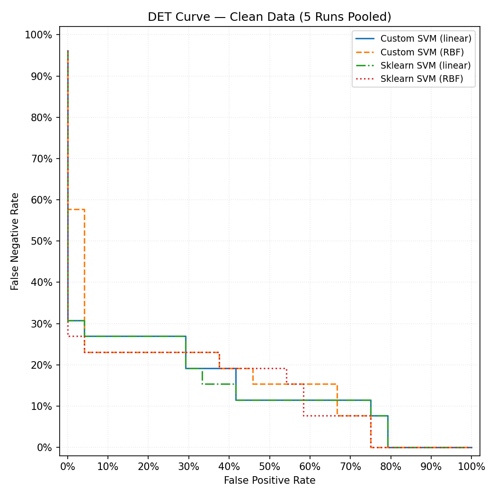
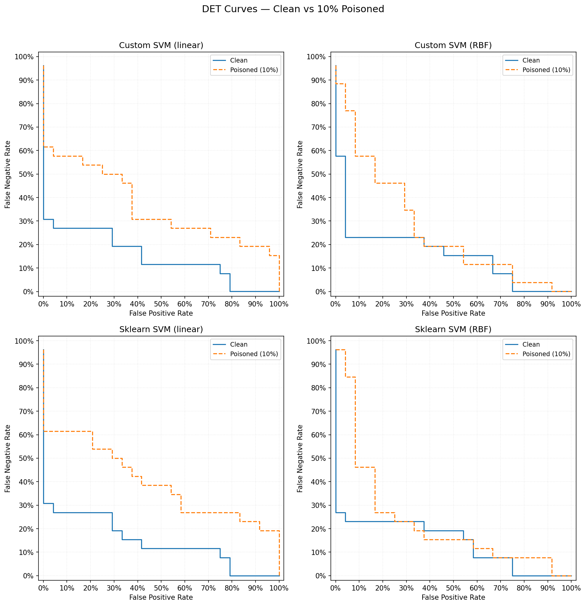

# CIS 735 Assignment Report — Part II: SVM for Parkinson's Disease Classification

## 1. Introduction

This report presents the implementation and evaluation of Support Vector Machines (SVMs) for identifying Parkinson's disease using gait dynamics data. The work encompasses:

1. **Custom SVM implementation** (from scratch, no API) with linear and RBF kernels  
2. **API-based SVM** (scikit-learn) for comparison  
3. **Clean data experiment** — 5 runs with performance metrics and a DET curve  
4. **Poisoned data experiment** — 10% label flipping and comparative DET curves  

---

## 2. Dataset and Methodology

### 2.1 Dataset

The [Gait Dynamics in Neuro-Degenerative Disease Data Base](https://archive.physionet.org/physiobank/database/gaitndd/) from PhysioNet was used. The dataset includes:

- **Parkinson's disease:** 15 subjects  
- **Healthy control:** 16 subjects  
- **Total:** 31 samples with 108 features  

Features are statistical summaries (mean, std, coefficient of variation, min, max, median, IQR, skewness, kurtosis) extracted from stride-to-stride gait intervals (left/right stride, swing, stance, double-support intervals).

### 2.2 Experimental Setup

- **Split:** 70% train / 30% test, repeated over 5 different random seeds (42, 123, 7, 2024, 999)  
- **Preprocessing:** Standardization (zero mean, unit variance)  
- **Models compared:**
  - Custom SVM (linear) — from-scratch SMO with linear kernel  
  - Custom SVM (RBF) — from-scratch SMO with Gaussian RBF kernel  
  - Sklearn SVM (linear)  
  - Sklearn SVM (RBF)  

### 2.3 Poisoning Procedure

For the poisoned experiment, **10% of the training labels were randomly flipped** to simulate label noise or adversarial poisoning. Each of the 5 runs used a different random seed for the poisoning selection.

---

## 3. Results

### 3.1 Clean Data — 5 Runs

#### Table 1: Custom SVM (linear)

| Run | Accuracy | Precision | Recall | F-Score |
|-----|----------|-----------|--------|---------|
| 1   | 0.8000   | 0.6667    | 1.0000 | 0.8000  |
| 2   | 0.8000   | 0.8000    | 0.8000 | 0.8000  |
| 3   | 0.8000   | 1.0000    | 0.6000 | 0.7500  |
| 4   | 0.8000   | 1.0000    | 0.7143 | 0.8333  |
| 5   | 0.8000   | 1.0000    | 0.6000 | 0.7500  |
| **Mean** | 0.8000 | 0.8933 | 0.7429 | 0.7867 |
| **Std**  | 0.0000 | 0.1373 | 0.1490 | 0.0323 |

#### Table 2: Custom SVM (RBF)

| Run | Accuracy | Precision | Recall | F-Score |
|-----|----------|-----------|--------|---------|
| 1   | 0.9000   | 0.8000    | 1.0000 | 0.8889  |
| 2   | 0.8000   | 0.8000    | 0.8000 | 0.8000  |
| 3   | 0.9000   | 1.0000    | 0.8000 | 0.8889  |
| 4   | 0.8000   | 1.0000    | 0.7143 | 0.8333  |
| 5   | 0.8000   | 1.0000    | 0.6000 | 0.7500  |
| **Mean** | 0.8400 | 0.9200 | 0.7829 | 0.8322 |
| **Std**  | 0.0490 | 0.0980 | 0.1311 | 0.0533 |

#### Table 3: Sklearn SVM (linear)

| Run | Accuracy | Precision | Recall | F-Score |
|-----|----------|-----------|--------|---------|
| 1   | 0.8000   | 0.6667    | 1.0000 | 0.8000  |
| 2   | 0.8000   | 0.8000    | 0.8000 | 0.8000  |
| 3   | 0.8000   | 1.0000    | 0.6000 | 0.7500  |
| 4   | 0.8000   | 1.0000    | 0.7143 | 0.8333  |
| 5   | 0.8000   | 1.0000    | 0.6000 | 0.7500  |
| **Mean** | 0.8000 | 0.8933 | 0.7429 | 0.7867 |
| **Std**  | 0.0000 | 0.1373 | 0.1490 | 0.0323 |

#### Table 4: Sklearn SVM (RBF)

| Run | Accuracy | Precision | Recall | F-Score |
|-----|----------|-----------|--------|---------|
| 1   | 0.9000   | 0.8000    | 1.0000 | 0.8889  |
| 2   | 0.9000   | 1.0000    | 0.8000 | 0.8889  |
| 3   | 0.9000   | 1.0000    | 0.8000 | 0.8889  |
| 4   | 0.8000   | 1.0000    | 0.7143 | 0.8333  |
| 5   | 0.8000   | 1.0000    | 0.6000 | 0.7500  |
| **Mean** | 0.8600 | 0.9600 | 0.7829 | 0.8500 |
| **Std**  | 0.0490 | 0.0800 | 0.1311 | 0.0544 |

---

### 3.2 Poisoned Data (10% Labels Flipped) — 5 Runs

#### Table 5: Custom SVM (linear) [POISONED]

| Run | Accuracy | Precision | Recall | F-Score |
|-----|----------|-----------|--------|---------|
| 1   | 0.7000   | 0.5714    | 1.0000 | 0.7273  |
| 2   | 0.4000   | 0.3333    | 0.2000 | 0.2500  |
| 3   | 0.5000   | 0.5000    | 0.4000 | 0.4444  |
| 4   | 0.6000   | 0.8000    | 0.5714 | 0.6667  |
| 5   | 0.8000   | 0.8000    | 0.8000 | 0.8000  |
| **Mean** | 0.6000 | 0.6010 | 0.5943 | 0.5777 |
| **Std**  | 0.1414 | 0.1800 | 0.2831 | 0.2024 |

#### Table 6: Custom SVM (RBF) [POISONED]

| Run | Accuracy | Precision | Recall | F-Score |
|-----|----------|-----------|--------|---------|
| 1   | 0.7000   | 0.5714    | 1.0000 | 0.7273  |
| 2   | 0.5000   | 0.5000    | 0.2000 | 0.2857  |
| 3   | 0.7000   | 1.0000    | 0.4000 | 0.5714  |
| 4   | 0.6000   | 0.8000    | 0.5714 | 0.6667  |
| 5   | 0.7000   | 0.7500    | 0.6000 | 0.6667  |
| **Mean** | 0.6400 | 0.7243 | 0.5543 | 0.5835 |
| **Std**  | 0.0800 | 0.1767 | 0.2647 | 0.1571 |

#### Table 7: Sklearn SVM (linear) [POISONED]

| Run | Accuracy | Precision | Recall | F-Score |
|-----|----------|-----------|--------|---------|
| 1   | 0.6000   | 0.5000    | 1.0000 | 0.6667  |
| 2   | 0.4000   | 0.3333    | 0.2000 | 0.2500  |
| 3   | 0.5000   | 0.5000    | 0.4000 | 0.4444  |
| 4   | 0.6000   | 0.8000    | 0.5714 | 0.6667  |
| 5   | 0.8000   | 0.8000    | 0.8000 | 0.8000  |
| **Mean** | 0.5800 | 0.5867 | 0.5943 | 0.5656 |
| **Std**  | 0.1327 | 0.1845 | 0.2831 | 0.1948 |

#### Table 8: Sklearn SVM (RBF) [POISONED]

| Run | Accuracy | Precision | Recall | F-Score |
|-----|----------|-----------|--------|---------|
| 1   | 0.5000   | 0.4444    | 1.0000 | 0.6154  |
| 2   | 0.9000   | 1.0000    | 0.8000 | 0.8889  |
| 3   | 0.8000   | 1.0000    | 0.6000 | 0.7500  |
| 4   | 0.8000   | 1.0000    | 0.7143 | 0.8333  |
| 5   | 0.8000   | 1.0000    | 0.6000 | 0.7500  |
| **Mean** | 0.7600 | 0.8889 | 0.7429 | 0.7675 |
| **Std**  | 0.1356 | 0.2222 | 0.1490 | 0.0925 |

---

### 3.3 Summary: Mean F-Score Comparison

| Model                | Clean F-Score | Poisoned F-Score | Δ (Poisoned − Clean) |
|---------------------|---------------|------------------|----------------------|
| Custom SVM (linear)  | 0.7867        | 0.5777           | −0.2090              |
| Custom SVM (RBF)     | 0.8322        | 0.5835           | −0.2487              |
| Sklearn SVM (linear) | 0.7867        | 0.5656           | −0.2211              |
| Sklearn SVM (RBF)    | 0.8500        | 0.7675           | −0.0825              |

---

## 4. DET Curve Analysis

### 4.1 DET Curve — Clean Data

**Figure 1: DET Curve for Clean Data (5 Runs Pooled).** Curves show the trade-off between False Positive Rate (x-axis) and False Negative Rate (y-axis) across classification thresholds.

**Observations:**

- **Custom vs Sklearn (linear):** The custom and sklearn linear SVMs produce nearly identical DET curves, supporting correct implementation of the from-scratch SMO solver.
- **Linear vs RBF:** RBF SVMs allow lower FNR for a given FPR in some regions, but linear models are more stable and often better at low FPR.
- **Sklearn RBF:** Generally achieves the best balance, reaching lower FNR at high FPR and showing good separation across thresholds.

### 4.2 DET Curves — Clean vs Poisoned (Comparative)

**Figure 2: DET Curves — Clean vs 10% Poisoned Data.** Each subplot compares one model on clean (solid blue) vs poisoned (dashed orange) data.

**Observations:**

1. **Impact of poisoning:** For all four models, the poisoned curve lies above and to the right of the clean curve, indicating worse performance. At a fixed FPR, the poisoned-trained models require a higher FNR.

2. **Linear models (Custom and Sklearn):** Both degrade similarly under poisoning; their poisoned curves are very close.

3. **RBF models:** The Custom RBF degrades more than the Sklearn RBF. The Sklearn RBF keeps its poisoned curve closer to the clean one, suggesting higher robustness to label noise.

4. **Sklearn RBF robustness:** Sklearn RBF has the smallest drop in mean F-Score (Δ ≈ −0.08) under poisoning, while the custom linear and RBF show larger drops (Δ ≈ −0.21 to −0.25).

---

## 5. Discussion and Conclusions

### 5.1 Custom vs API-Based SVM

- **Linear kernel:** Custom and Sklearn linear SVMs give identical results, validating the from-scratch SMO implementation.
- **RBF kernel:** Sklearn RBF slightly outperforms the custom RBF (mean F-Score 0.85 vs 0.83 on clean data), likely due to different gamma scaling (e.g. `gamma='scale'`) and a more optimized solver (e.g. libsvm).

### 5.2 Effect of Label Poisoning

- Poisoning 10% of labels substantially hurts all models.
- Sklearn RBF is most robust (F-Score drops from 0.85 to 0.77).
- Both linear SVMs degrade by about 0.21 in F-Score.
- Custom RBF shows the largest drop (Δ ≈ −0.25), suggesting sensitivity to mislabeled support vectors.

### 5.3 Recommendations

- For this gait dataset, **Sklearn RBF** offers the best overall performance and robustness to label noise.
- The from-scratch linear SVM matches Sklearn and can be used for teaching and debugging.
- Under noisy labels, RBF models with careful hyperparameter tuning and robust solvers are preferable to simple linear SVMs.

---

## References

- PhysioNet: [Gait Dynamics in Neuro-Degenerative Disease Data Base](https://archive.physionet.org/physiobank/database/gaitndd/)
- Platt, J. (1998). Sequential Minimal Optimization: A Fast Algorithm for Training Support Vector Machines.
