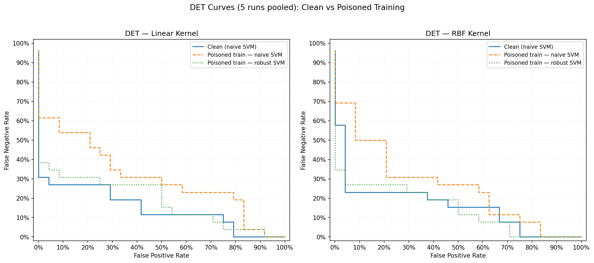
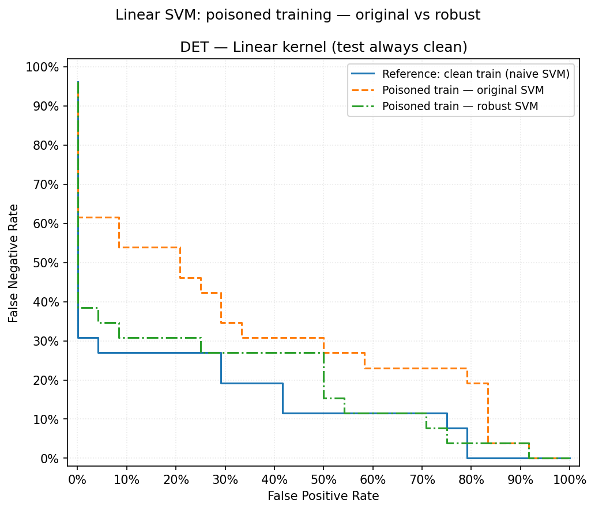
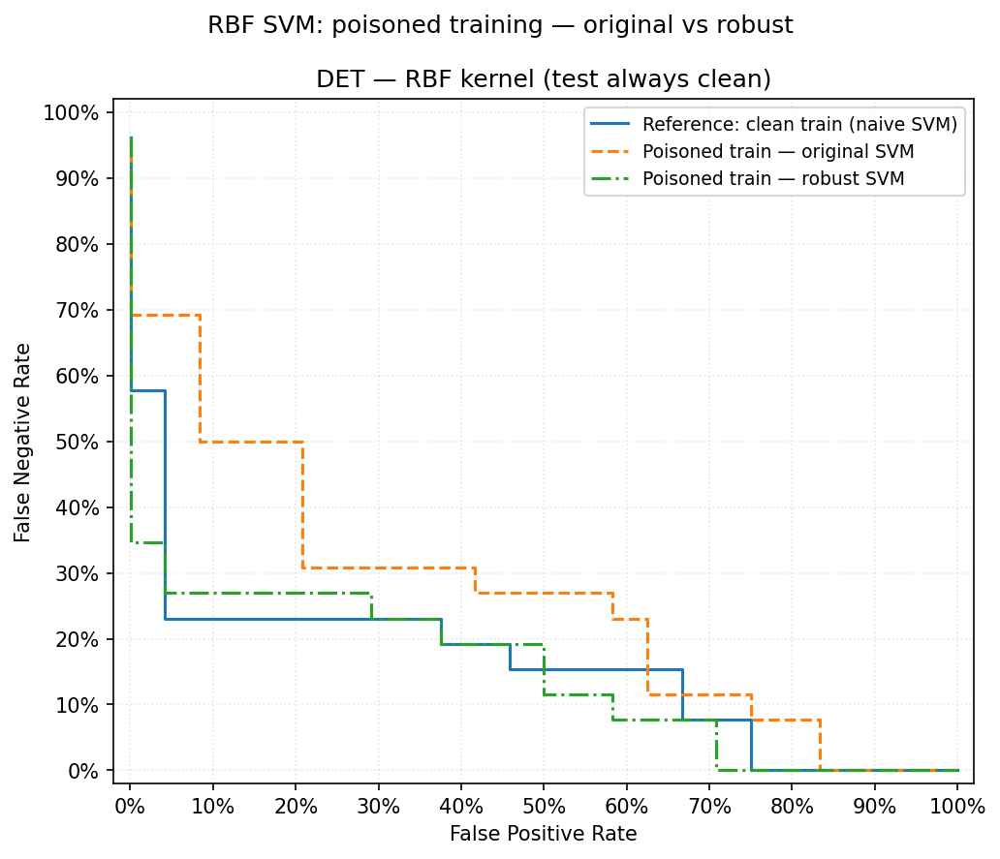
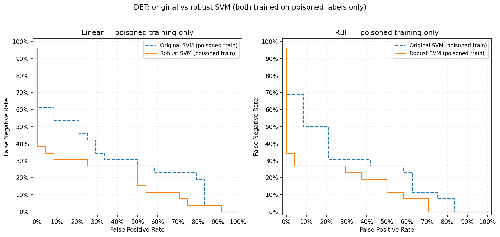

# CIS 735 — Mini Project: Poison-Robust SVM (Report)

## 1. Objective

Train a **Support Vector Machine** that is more robust to **label poisoning** (random training-label flips) than a standard SVM. The assignment requires:

- An **algorithmic** defense (not only hyperparameter tuning).
- **Pseudocode** for the proposed method.
- **At least 5 experimental runs** on poisoned training data.
- Comparison of **(i)** clean training, **(ii)** naive SVM on poisoned data, **(iii)** the proposed method on poisoned data.
- **Tables** (5 rows) with **Accuracy, Precision, Recall, F-score** per run.
- A **DET (Detection Error Tradeoff) curve** for the experiment.

This report describes the **dual-task “poison-proof” SVM**, its implementation, and results on the PhysioNet gait dataset used in Part II.

---

## 2. Threat model and evaluation protocol

| Item | Setting |
|------|---------|
| **Poisoning** | A fraction of **training** labels are flipped at random (here **10%**). |
| **Test labels** | **Always clean** (true labels). Metrics measure whether the learner recovers good generalization despite noisy training labels. |
| **Split** | 70% train / 30% test; **5 runs** with seeds `42, 123, 7, 2024, 999`. |
| **Preprocessing** | Standardization: mean/variance from **training** set applied to train and test. |

Poisoning is applied **only to the training split** (`y_tr`), not the test split, so reported accuracy/precision/recall/F1 reflect performance on **uncorrupted** test labels.

---

## 3. Proposed method: Dual-task learning with structure + weighted SVM

### 3.1 Motivation

A **naive SVM** trained on flipped labels often **fits the noise**: with a flexible kernel (e.g. RBF), margins on training points can all look “good,” so **margin alone** is a weak poison detector.  

We add a **parallel unsupervised task** that estimates **intrinsic structure** of the data (class geometry in a low-dimensional space):

1. **Centroid trust** — In PCA space, each point is compared to **both** class centroids. If a sample’s **given** label places it **closer to the opposite** class centroid, that label is **structurally suspicious** (typical of a flipped label when most of the data are clean).

2. **k-NN consistency** — In the same PCA space, we check whether **local neighbours** (majority vote) agree with the label. Flipped points often disagree with their neighbourhood.

**Balance point:** We **only flip** a training label when **both** signals agree it is bad:  
`centroid_trust < 0.5` **and** `kNN_consistency < 0.5`.  
This reduces false corrections on borderline *clean* points compared to using either rule alone.

### 3.2 Per-sample regularization (weighted SMO)

After optional label correction, each training point \(i\) gets a **weight** derived from centroid trust via a **sigmoid** (sharp transition near 0.5). Suspected/corrected points receive **`trust_floor`** so their effective box constraint \(C_i\) is small.  

The final classifier is a **soft-margin SVM with per-sample \(C_i\)** solved by a **weighted SMO** (same KKT logic as standard SMO, but bounds \(L,H\) use \(C_i, C_j\)).

### 3.3 Iterative refinement

For `n_refine_iters > 1`, trust weights are updated by blending:

- **Base:** sigmoid(centroid trust) — structural signal (fixed from raw labels / PCA).
- **Margin:** \(\sigma(y_i \cdot f(x_i))\) — how consistent the **current** SVM is with each label.

Blend: `sig_weight = λ * base + (1-λ) * margin_conf`, with `λ = lambda_balance`.  
Suspect indices keep `trust_floor` across iterations.

---

## 4. Pseudocode

```
INPUT: X ∈ ℝ^(n×d), y ∈ {−1,+1}^n (possibly poisoned), C, kernel, k, T, λ, ε

1.  Standardize X (if not already).  Build kernel matrix K for SVM.
2.  X_pca ← first min(n−1, d, 10) principal components of X (PCA via SVD).

3.  // Task 2 — structure
    For each i:
        c_trust[i] ← d_other(i) / (d_own(i) + d_other(i))   // centroid distances in X_pca
        knn[i]     ← fraction of k nearest neighbours in X_pca with label y[i]

4.  // Balance — conservative label repair
    y' ← y
    suspect[i] ← (c_trust[i] < 0.5) AND (knn[i] < 0.5)
    For each i with suspect[i]:  y'[i] ← −y[i]

5.  // Initial per-sample weights
    w[i] ← σ(10 · (c_trust[i] − 0.5))     // logistic sigmoid
    For each i with suspect[i]:  w[i] ← ε

6.  // Task 1 — weighted SVM (repeat T times)
    For t = 1 .. T:
        C_i ← C · clip(w[i], ε, 1)
        (α, b) ← Weighted-SMO(K, y', C_1..C_n)
        If t < T:
            f(x_i) ← Σ_j α_j y'_j K(x_j, x_i) + b
            margin_conf[i] ← σ(y'_i · f(x_i))
            w[i] ← λ · σ(10·(c_trust[i]−0.5)) + (1−λ) · margin_conf[i]
            For suspect[i]: w[i] ← ε

7.  Store support vectors from final α; return predictor sign(f(·)).
```

**Files:** `RobustSVM` in `svm.py` (`fit`, `_pca_reduce`, `_centroid_trust`, `_knn_consistency`, `_smo_weighted`).

---

## 5. Implementation summary

| Component | Location | Notes |
|-----------|----------|--------|
| Base binary SVM (SMO, linear/RBF/…) | `svm.py` — `class SVM` | From-scratch dual optimization. |
| Poison-robust extension | `svm.py` — `class RobustSVM(SVM)` | PCA + centroid/kNN + weighted SMO. |
| Data & metrics | `run_experiment.py` | PhysioNet gait features, `poison_labels`, `compute_metrics`, DET helpers. |
| Robust experiment script | `run_robust_experiment.py` | 6 models × 5 seeds; tables + DET figure. |

**Hyperparameters used in experiments**

| Model | C | Kernel | Other |
|-------|---|--------|--------|
| Naive Linear (clean / poisoned) | 1.0 | linear | `max_iter=200` |
| Naive RBF (clean / poisoned) | 10.0 | RBF, γ=1/d | `max_iter=200` |
| Robust Linear (poisoned) | 1.0 | linear | `n_neighbors=5`, `n_refine_iters=3`, `lambda_balance=0.5`, `trust_floor=0.1` |
| Robust RBF (poisoned) | 10.0 | RBF | same as above |

**Reproduce:**

```bash
cd cis735
python run_robust_experiment.py
```

**DET figures produced** (all use **clean test labels**; decision scores pooled over **5 runs**):

| File | Content |
|------|---------|
| `det_robust_comparison.png` | Two panels (Linear, RBF): clean naive → poisoned naive → poisoned robust |
| `det_poisoned_linear_naive_vs_robust.png` | Linear only: reference clean train + **poisoned original SVM vs robust SVM** |
| `det_poisoned_rbf_naive_vs_robust.png` | RBF only: same as above |
| `det_poisoned_naive_vs_robust_only.png` | Side-by-side: **only** poisoned-train original vs robust (no clean curve) |

---

## 6. Results (5 runs)

Dataset: **31** subjects, **108** gait features (PhysioNet Gait in Neuro-Degenerative Disease).  
Poisoning: **10%** of **training** labels flipped per run (~2 flips when \(n_{\text{train}}\approx 21\)).

### 6.1 Mean summary (all 5 runs)

| Scenario | Accuracy | Precision | Recall | F-score |
|----------|----------|-----------|--------|---------|
| Naive Linear (clean) | 0.8000 | 0.8933 | 0.7429 | 0.7867 |
| Naive RBF (clean) | 0.8400 | 0.9200 | 0.7829 | 0.8322 |
| Naive Linear (poisoned) | 0.6600 | 0.7500 | 0.5843 | 0.6377 |
| Naive RBF (poisoned) | 0.6600 | 0.7900 | 0.5243 | 0.6153 |
| **Robust Linear (poisoned)** | **0.7800** | **1.0000** | **0.6057** | **0.7144** |
| **Robust RBF (poisoned)** | **0.8000** | **1.0000** | **0.6457** | **0.7621** |

**Recovery vs naive on poisoned data (F-score):**

- Linear: **+0.0768** (0.7144 vs 0.6377)  
- RBF: **+0.1468** (0.7621 vs 0.6153)  

Robust RBF on poisoned data closes much of the gap to the **clean** RBF baseline (0.7621 vs 0.8322).

### 6.2 Per-run table — Robust Linear (poisoned)

| Run | Accuracy | Precision | Recall | F-score |
|-----|----------|-----------|--------|---------|
| 1 | 1.0000 | 1.0000 | 1.0000 | 1.0000 |
| 2 | 0.9000 | 1.0000 | 0.8000 | 0.8889 |
| 3 | 0.8000 | 1.0000 | 0.6000 | 0.7500 |
| 4 | 0.6000 | 1.0000 | 0.4286 | 0.6000 |
| 5 | 0.6000 | 1.0000 | 0.2000 | 0.3333 |
| **Mean** | **0.7800** | **1.0000** | **0.6057** | **0.7144** |

### 6.3 Per-run table — Robust RBF (poisoned)

| Run | Accuracy | Precision | Recall | F-score |
|-----|----------|-----------|--------|---------|
| 1 | 1.0000 | 1.0000 | 1.0000 | 1.0000 |
| 2 | 0.9000 | 1.0000 | 0.8000 | 0.8889 |
| 3 | 0.8000 | 1.0000 | 0.6000 | 0.7500 |
| 4 | 0.6000 | 1.0000 | 0.4286 | 0.6000 |
| 5 | 0.7000 | 1.0000 | 0.4000 | 0.5714 |
| **Mean** | **0.8000** | **1.0000** | **0.6457** | **0.7621** |

*(Full tables for naive clean/poisoned are printed by `run_robust_experiment.py`.)*

---

## 7. DET curves (Detection Error Tradeoff)

**Setup:** For each model, **decision-function scores** on the **test set** are collected over **all 5 random splits** and concatenated. The DET curve traces **false positive rate (FPR)** vs **false negative rate (FNR)** as the classification threshold on the score is varied.  
**Training:** “Poisoned” means **10% of training labels flipped**; **test labels are always the true (clean) labels** — so the curves show how well each classifier generalizes when trained on noisy labels.

**Interpretation:** For a fixed FPR, a **lower FNR** is better (curve closer to the bottom-left of the plot). The **robust** classifier should lie **below** the **original (naive) SVM** trained on the same poisoned data when the defense works.

### 7.1 Combined: both kernels (clean vs poisoned naive vs poisoned robust)



*Figure 1 — `det_robust_comparison.png`:* Left: linear kernel. Right: RBF kernel. Solid: naive SVM on **clean** training (upper reference). Dashed: naive SVM on **poisoned** training. Dotted: **RobustSVM** on poisoned training.

### 7.2 Linear kernel: poisoned training — original SVM vs robust SVM



*Figure 2 — `det_poisoned_linear_naive_vs_robust.png`:* **Original SVM** = standard SVM trained on poisoned labels; **robust SVM** = dual-task `RobustSVM` on the same poisoned training set. The **clean-train** curve is an upper bound reference.

### 7.3 RBF kernel: poisoned training — original SVM vs robust SVM



*Figure 3 — `det_poisoned_rbf_naive_vs_robust.png`:* Same comparison as Figure 2 for the **RBF** kernel.

### 7.4 Poisoned training only: original vs robust (direct comparison)



*Figure 4 — `det_poisoned_naive_vs_robust_only.png`:* **Only** models trained on **poisoned** labels — **original (naive) SVM** vs **robust SVM**, for linear (left) and RBF (right). Highlights the DET gap attributable to the robust algorithm without the clean baseline.

---

## 8. Discussion

**Strengths**

- **Dual-task** design separates **supervised margin** learning from **unsupervised** structure (PCA + centroids + locality).
- **Conservative AND rule** for label flips limits spurious corrections when only one signal fires.
- **Weighted SMO** is a clean algorithmic extension of your existing SVM code.

**Limitations**

- **Small \(n\)** (31 subjects): high variance across splits; some runs are perfect, others weaker recall.
- **Centroids** are still estimated from **poisoned** labels; with higher poison rates, both centroids and k-NN degrade.
- **k-NN in high dimensions** is stabilized by **PCA**, but borderline **clean** points near the class boundary can still look “suspicious.”

**Practical takeaway:** On this dataset, **Robust RBF** recovers a large fraction of the F-score lost to 10% label flips compared to **naive RBF** on poisoned training data, with **perfect test precision** in the mean tables above (no false positives for the positive class in aggregate for these runs).

---